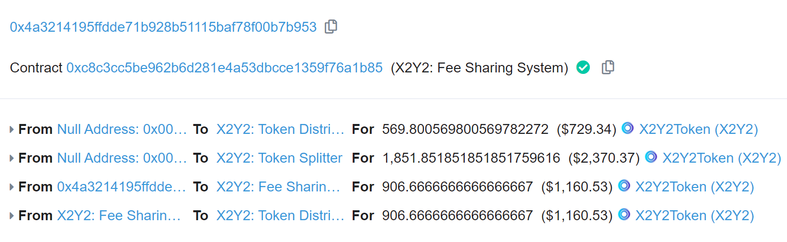
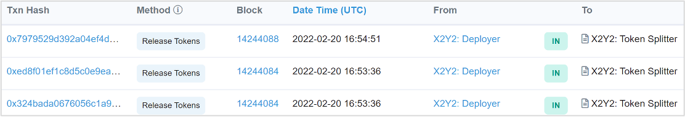
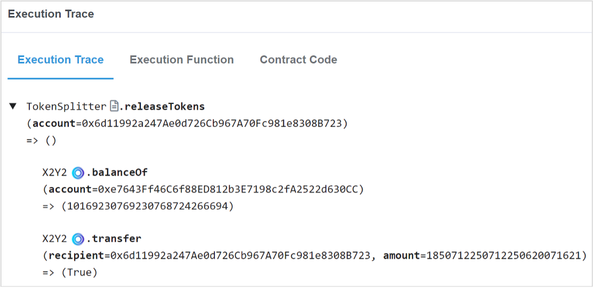

# x2y2手续费分配机制分析

## 涉及合约及地址

在当前系统下，涉及token分配、手续费分配的智能合约包括：

| 合约名称 | 地址 | 功能简述 |
| --- | --- | --- |
| Presale | [0xc2F44Bc508b6b50047a2F3AfB1984eD105070bE1](https://etherscan.io/address/0xc2F44Bc508b6b50047a2F3AfB1984eD105070bE1) | ILO质押池，ILO用户领取解锁token、奖励的合约 |
| FeeSharingSystem | [0xc8C3CC5be962b6D281E4a53DBcCe1359F76a1B85](https://etherscan.io/address/0xc8C3CC5be962b6D281E4a53DBcCe1359F76a1B85) | 公共质押池，二级投资者主要交互的合约 |
| FeeSharingSetter | [0xF704353B5C98577d3B4274614e62Fc79676D33bD](https://etherscan.io/address/0xF704353B5C98577d3B4274614e62Fc79676D33bD) | 根据质押比例分配WETH手续费 |
| FeeManagement | [0xD823C605807cC5E6Bd6fC0d7e4eEa50d3e2d66cd](https://etherscan.io/address/0xD823C605807cC5E6Bd6fC0d7e4eEa50d3e2d66cd) | 手续费管理合约（新增） |
| TokenSplitter | [0xe7643Ff46C6f88ED812b3E7198c2fA2522d630CC](https://etherscan.io/address/0xe7643Ff46C6f88ED812b3E7198c2fA2522d630CC) | 为财库、Devs、Listing Rewards按比例分配token |
| ListingRewardDistributorV2 | [0xc4CcDdcd0239D8425b54322e8E5F99D19FB7Ba43](https://etherscan.io/address/0xc4CcDdcd0239D8425b54322e8E5F99D19FB7Ba43) | NFT Listing Rewards奖励分配 |
| TokenDistributor | [0xB329e39Ebefd16f40d38f07643652cE17Ca5Bac1](https://etherscan.io/address/0xB329e39Ebefd16f40d38f07643652cE17Ca5Bac1) | 负责新token的mint，包括质押奖励、团队解锁、Listing Rewards |
| VestingContractWithFeeSharing | [0x6d11992a247Ae0d726Cb967A70Fc981e8308B723](https://etherscan.io/address/0x6d11992a247Ae0d726Cb967A70Fc981e8308B723) | *财库* |
| VestingContractWithFeeSharing | [0x13C19498De6f026EfF6DfC56e56febe73d50C101](https://etherscan.io/address/0x13C19498De6f026EfF6DfC56e56febe73d50C101) | *Devs* |

*财库、Devs未找到官方文档说明，且链上数据无差异，故标签可能存在错误，但占比缘故不影响分析。*

此外，以下地址参与了系统运行：

| 地址 | 功能 |
| ---- | ---- |
| [0xDC43b25f3AbF65825E52b73441E47F2Ce0F9c47D](https://etherscan.io/address/0xDC43b25f3AbF65825E52b73441E47F2Ce0F9c47D) | X2Y2Deployer |
| [0x099BA539CDe20Ff8b87B18460024a9E3acc9E025](https://etherscan.io/address/0x099BA539CDe20Ff8b87B18460024a9E3acc9E025) | 交易手续费钱包地址（*已弃用*） |
| [0x5D7CcA9Fb832BBD99C8bD720EbdA39B028648301](https://etherscan.io/address/0x5D7CcA9Fb832BBD99C8bD720EbdA39B028648301) | 多签钱包地址 |

*Devs近期将合约Owner迁移至多签钱包，相关合约代码未重新部署，不影响分析。*

## Token释放分析

目前未铸造的token分布于以下功能：
- 公共质押池中未分配的X2Y2质押奖励，投资者通过在合约[0xc8C3CC5be962b6D281E4a53DBcCe1359F76a1B85](https://etherscan.io/address/0xc8C3CC5be962b6D281E4a53DBcCe1359F76a1B85)质押、领取。
- NFT Listing Rewards，NFT卖家通过在智能合约[0xc4CcDdcd0239D8425b54322e8E5F99D19FB7Ba43](https://etherscan.io/address/0xc4CcDdcd0239D8425b54322e8E5F99D19FB7Ba43)领取。
- 财库：合约地址为[0x6d11992a247Ae0d726Cb967A70Fc981e8308B723](https://etherscan.io/address/0x6d11992a247Ae0d726Cb967A70Fc981e8308B723)。
- Devs：合约地址为[0x13C19498De6f026EfF6DfC56e56febe73d50C101](https://etherscan.io/address/0x13C19498De6f026EfF6DfC56e56febe73d50C101)。

上述为铸造的token随着系统的运行逐步释放，释放比例如官方文档描述，不再赘述。

铸造的计算成本（Gas费用）由**二级市场投资者**承担，当二级市场投资进行质押、提取时，首先调用[FeeSharingSystem](https://etherscan.io/address/0xc8C3CC5be962b6D281E4a53DBcCe1359F76a1B85)合约，其内部会转到[TokenDistributor](https://etherscan.io/address/0xB329e39Ebefd16f40d38f07643652cE17Ca5Bac1)合约，根据区块、每区块释放数量，计算当前应释放的token数量，并分配至不同的合约，完成以下功能的token释放：
- 公共质押池的质押者的质押奖励，发送至[FeeSharingSystem](https://etherscan.io/address/0xc8C3CC5be962b6D281E4a53DBcCe1359F76a1B85)
- NFT Listing Rewards奖励，发送至[TokenSplitter](https://etherscan.io/address/0xB329e39Ebefd16f40d38f07643652cE17Ca5Bac1)
- 财库释放token数量，发送至[TokenSplitter](https://etherscan.io/address/0xB329e39Ebefd16f40d38f07643652cE17Ca5Bac1)
- Devs释放token数量，发送至[TokenSplitter](https://etherscan.io/address/0xB329e39Ebefd16f40d38f07643652cE17Ca5Bac1)

示例：
 - https://etherscan.io/tx/0x8662e2144bdb12cb08138983c8669489df8b7722001240f77125cff890f28c0d



而[X2Y2Deployer](https://etherscan.io/address/0xDC43b25f3AbF65825E52b73441E47F2Ce0F9c47D)会在**每日分配手续费前**，调用[TokenSplitter](https://etherscan.io/address/0xB329e39Ebefd16f40d38f07643652cE17Ca5Bac1)，将当日为NFT Listing Rewards、财库、Devs铸造的token发送到对应的合约中：





示例：
- https://etherscan.io/tx/0x7979529d392a04ef4de01a0fc36893499336e18424bc0c582bedc281e0b1966b
- https://etherscan.io/tx/0xed8f01ef1c8d5c0e9eadac301c70bcb7aa247baeb2297882dee554380a51a806
- https://etherscan.io/tx/0x324bada0676056c1a97c1c3a1d33607da2b57fce84362405ffbc91c394912650

综上，未铸造的token将按合约设定，由质押者进行驱动，逐步释放到对应合约中，直至铸造完毕。

## 交易手续费分配分析

根据官方文档描述，NFT买家支付的交易费（交易额的2%，以WETH计价）会每日进行统计，并在下一个24小时内以线性方式发放。目前，参与手续费分配的投资者包括：
- ILO质押池，即[0xc2F44Bc508b6b50047a2F3AfB1984eD105070bE1](https://etherscan.io/address/0xc2F44Bc508b6b50047a2F3AfB1984eD105070bE1)
- 公共质押池，即[0xc8C3CC5be962b6D281E4a53DBcCe1359F76a1B85](https://etherscan.io/address/0xc8C3CC5be962b6D281E4a53DBcCe1359F76a1B85)
- 线性释放的财库，即锁定阶段参与手续费分配，地址为[0x6d11992a247Ae0d726Cb967A70Fc981e8308B723](https://etherscan.io/address/0x6d11992a247Ae0d726Cb967A70Fc981e8308B723)
- 线性释放的Devs，即锁定阶段参与手续费分配，地址为[0x13C19498De6f026EfF6DfC56e56febe73d50C101](https://etherscan.io/address/0x13C19498De6f026EfF6DfC56e56febe73d50C101)

手续费的分配由[FeeSharingSetter](https://etherscan.io/address/0xf704353b5c98577d3b4274614e62fc79676d33bd)合约的*updateRewards*函数完成，每天的分配由[X2Y2Deployer](https://etherscan.io/address/0xDC43b25f3AbF65825E52b73441E47F2Ce0F9c47D)完成，且完成每日铸造的新token分配完成之后进行分配。

接收手续费的钱包首先将ETH转换为WETH，并全部转入[FeeSharingSetter](https://etherscan.io/address/0xf704353b5c98577d3b4274614e62fc79676d33bd)。之后，[X2Y2Deployer](https://etherscan.io/address/0xDC43b25f3AbF65825E52b73441E47F2Ce0F9c47D)调用*updateRewards*函数，根据token比例，将手续费分配至财库、Devs、IOL质押池，剩余的部分发送至公共质押池。

接收手续费的各方持有token数量的特点如下：
- ILO质押池：保存不变，ILO用户通过*withdraw*提取已释放token不影响手续费比例计算。
- 公共质押池：市场化行为，短线投资者可能提取并售卖，长线投资者则在币价下降时购入质押，根据token总体流通情况、市场深度，该部分的比例最大。
- 财库：每日线性释放、持续增加，锁定期结束后可提取。
- Devs：每日线性释放、持续增加，锁定期结束后可提取。

总质押的token数量可通过以下方式计算：

```txt
Presale.getTotalStaked() + balanceOf(财库) + balanceOf(Devs) + TokenDistributor.totalAmountStaked
```

如在高度为**14252551**时，质押的数量如下：

```log
#14252551
Total Staked:	86842428.906560302996069816
 - presale:	15000000.0
 - vesting1:	11193162.393162392604891293
 - vesting2:	11193162.393162392604891293
 - public:	49456104.12023551778628723
```

个人质押占比可通过以下方式计算：

```txt
FeeSharingSystem.calculateSharesValueInX2Y2(address) / TokenDistributor.totalAmountStaked
```

如在高度为**14252551**时，[鲸鱼](https://etherscan.io/address/0xc41Cb75DE3D6C7918e6F1e3767F6cC86e67c9206)质押的数量如下：

```log
#14252551
 - whaleBalance:	2208930.57294998910693868
```

结合上述公共质押池的质押数量可以计算出，此时该鲸鱼在公共质押池中的占比约为**4.44%**，占全部质押池的**2.55%**。

在上述token比例分配的机制下，ILO用户的持有比例将不断被稀释。*2022-02-19 UTC*、*2022-02-20 UTC*、*2022-02-21 UTC*分配详情如下：

- [2022-02-19 UTC](https://etherscan.io/tx/0x7f10e23ee7d170ad4fa33904714f684fffcb75477aa72bb3fafa2c4e379b010f)
  
  当日手续费：**9.2708** WETH
  
  | 分布 | WETH | 比例 |
  | --- | --- | --- |
  | ILO | 2.009376089395648194 | **~21.67%** |
  | 财库 | 0.928969105260768666 | ~10.02% |
  | Devs | 0.928816446108677828 | ~10.02% |
  | 公共质押池 | 5.403638359234905312 | ~58.28% |

- [2022-02-20 UTC](https://etherscan.io/tx/0xa57880eed43c6a71512852272f651a18e3c34f497df4ddd6425ed887082ea899)

  当日手续费：**6.73157** WETH

  | 分布 | WETH | 比例 |
  | --- | --- | --- |
  | ILO | 1.286188203416903486 | **~19.1%** |
  | 财库 | 0.753317865693581212 | ~11.19% |
  | Devs | 0.753269007642169364 | ~11.19% |
  | 公共质押池 | 3.938794923247345938 | ~58.5% |

- [2022-02-21 UTC](https://etherscan.io/tx/0x213a8a1ecfe94aa2ce9b0f7c2e286ecdf1e08927fe21c295d4bd31a3247045ce)

  当日手续费：**17.09716** WETH

  | 分布 | WETH | 比例 |
  | --- | --- | --- |
  | ILO | 2.953134812430684338 | **~17.27%** |
  | 财库 | 2.20366116829585414 | ~12.89% |
  | Devs | 2.20366116829585414 | ~12.89% |
  | 公共质押池 | 9.736702850977607382 | ~56.95% |

另外，根据代码显示，当ILO质押的token全部解锁后（即360天锁定期），开发者将移除ILO的手续费分成。

总体分配比例可参考：[Distribution of WETH fees on x2y2](https://dune.xyz/queries/443677)

## ILO手续费收益分析

ILO用户的收益由Presale合约（[0xc2F44Bc508b6b50047a2F3AfB1984eD105070bE1](https://etherscan.io/address/0xc2f44bc508b6b50047a2f3afb1984ed105070be1)）单独处理 ，用户可通过*harvest*函数获取手续费收益（WETH），以及通过*withdraw*获取手续费收益及已释放的x2y2 Token收益。原则上1000名ILO用户应**平分**这部分手续费收益，但过早的提取已释放的x2y2 token，可能导致后期分配的手续费收益减少。

对于这部分的WETH手续费收益，其收益分配逻辑如下：

```solidity
function _pendingReward(address user) internal view returns (uint256, uint256) {
  uint256 totalReward = _totalReward();
  uint256 userDebt = userInfo[user].rewardDebt;
  uint256 userTokensLeft = TOKENS_PER_SHARE - userInfo[user].tokensClaimed;

  uint256 theoreticalReward = totalReward / totalShareSold;
  uint256 userReward = ((theoreticalReward - userDebt) * userTokensLeft) / TOKENS_PER_SHARE;

  return (userReward, theoreticalReward);
}
```

即：
1. 将当前合约的WETH余额全部作为分配奖励，并拆分成1000份。
2. 结果1减去已提取的WETH收益，再乘以用户未提取token占个人总份额（15000）的比例，得到最终的结果。

所以，提取未锁定token的时机可能影响手续费收益。

假设在第180天时，Presale合约累计获得手续费1000 ether，此时x2y2解锁一半，用户A进行了*withdraw*操作，提取手续费奖励、一半的解锁token，那么他此时获取的WETH为：

```txt
(1000 ether / 1000 - 0) * 1 = 1 ether
```

假设平台持续正向发展，在360天，即Token全部解锁时，Presale合约累计获得手续费10000 ether，用户A再次进行提取，此时获取的手续费为：

```txt
(10000 / 1000 - 1) / 0.5 = 4.5 ether
```

用户B在全部解锁后一次性提取，获取的WETH手续费为：

```txt
(10000 / 1000 - 0) * 1 = 10 ether
```

用户A无法提取的部分5.5 ether将作为财库的收益，开发团队可通过*treasuryWithdraw*提取。

所以，ILO用户应根据自身情况合理计算预期收益，适时通过提取token抛售回本，或是静待平台发展，分享属于自己的全部红利。

## 附

放弃LooksRare的[鲸鱼](https://etherscan.io/address/0xc41Cb75DE3D6C7918e6F1e3767F6cC86e67c9206)总共投入的购买量应为**1467.2860322613503 ether**，对应的tx如下：

- [tx1](https://etherscan.io/tx/0x69f312b35428b12ec3f6ae9b9575496d3ad4386aaf47c515f6fea37961ec14f7)：15.625485084990585935 ether
- [tx2](https://etherscan.io/tx/0x74e89ac0105600c5ffc06420d53331fbc3de83dfba13931d78b493552baecadc)：14.351345496922847783 + 344.785342172979723157 = 359.1366876699026 ether
- [tx3](https://etherscan.io/tx/0xdcaff073ed743c7e4359ea8169259ebdc906c8f6b03050d033963bb5ed2a343f)：5.780943199105155843 + 282.627216775268462417 = 288.4081599743736 ether
- [tx4](https://etherscan.io/tx/0x2f5a0ffe96ef94218a1eeeaf1327fc995792aa84945570edb36637a6f8ddd3f5)：10.57100665034544672 + 257.673667449061890958 = 268.24467409940735 ether
- [tx5](https://etherscan.io/tx/0x9a3174c6679232d065c1cdf07d4ebb7d57a50f3b0d77582f90923c029036e800)：10.839610607183793336 + 261.351227770724985315 = 272.19083837790873 ether
- [tx6](https://etherscan.io/tx/0x8c0486985a259dfa6c91262826704522f423e3e438cd95d177d72e71e3875747)：5.298638789558938217 + 258.381548265208449952 = 263.6801870547674 ether
